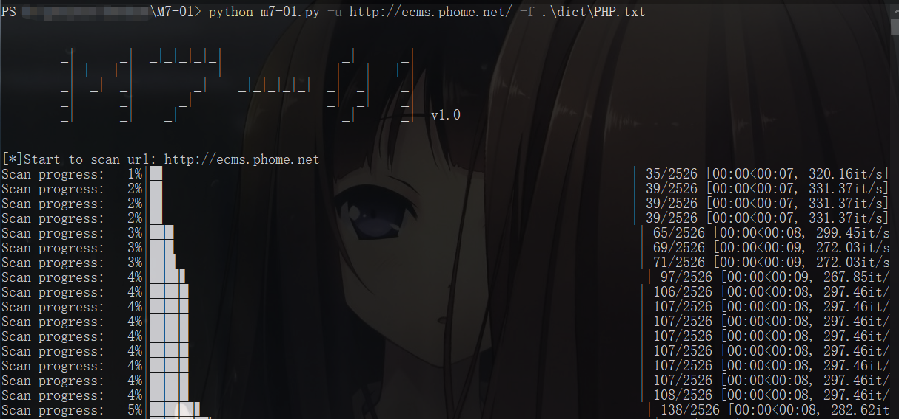
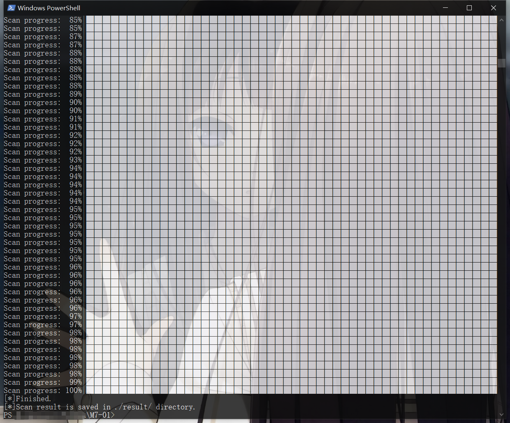

# M7-01

用Python3重写的个人使用的一款小型Web目录扫描器。关键还是在于扫描的字典，扫描字典是参考自：[LoRexxar/BScanner](https://github.com/LoRexxar/BScanner)

强推这个高级Web目录扫描项目，能学到很多东西：[H4ckForJob/dirmap](https://github.com/H4ckForJob/dirmap)

使用方法如下：

```bash
Usage: python m7-01.py -u <Target URL> [-f <Custom dictionary file name>] [-t <Thread_count>] [-s <Sleep_time>] [-l <Log_level>]

Options:
  -h, --help            show this help message and exit
  -v, --version         show scanner's version and exit
  -u URL, --url=URL     target url for scan
  -f FILENAME, --file=FILENAME
                        [Optional] custom dictionary filename (default
                        ./dict/DIR.txt)
  -t COUNT, --thread=COUNT
                        [Optional] scan thread_count (default 30)
  -s SLEEP, --sleep=SLEEP
                        [Optional] sleep time per request (default 1s)
  -l LOGLEVEL, --log-level=LOGLEVEL
                        [Optional] log level 1-5:
                        CRITICAL,ERROR(default),WARNING,INFO,DEBUG
```

-u参数为必须项、指定扫描的目标URL；其余为可选项，-f参数指定使用自定义的字典文件，-t参数指定多线程的数量，-s参数指定线程请求之间的休眠时间，-l参数指定日志记录的级别。

扫描结果保存在result目录下新生成的以扫描目标的域名为名的文件中。

具体扫描过程可根据log目录下的日志文件进行分析。

pic：





